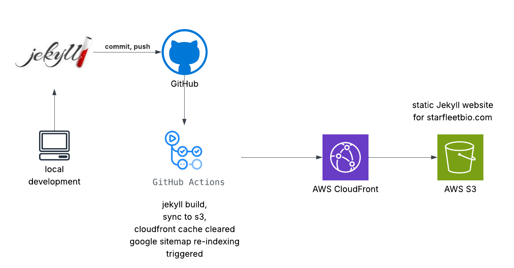

# web

A static Jekyll-based web site for a FQDN, served by Route 53, CloudFront, Certificate Manager, and S3 with CI/CD through github actions.

Roughly followed these blog posts:
* [pagetree](https://pagertree.com/blog/jekyll-site-to-aws-s3-using-github-actions)
* [jennas-runbooks](https://jksprattler.github.io/jennas-runbooks/DevOps/CI-CD/jekyll-s3-actions.html)

## AWS perspective

Involves an AWS account and configuring Route 53, CouldFront, Certificate Manager, and S3.


## Github perspective

Involves a github account and configuring github scerets, and a github [action](.github/workflows/build_and_deploy.yml).


## Dev environment

### Install Homebrew [notes](https://brew.sh)

``` bash
/bin/bash -c "$(curl -fsSL https://raw.githubusercontent.com/Homebrew/install/HEAD/install.sh)"
```

### Install rbenv [notes](https://github.com/rbenv/rbenv)

``` bash
brew install rbenv
rbenv init
```

### Clone this repo

``` bash
git clone https://github.com/starfleetbio/web.git
cd web
```

## Develop and serve the app locally

``` bash
bundle exec jekyll serve -l -o
```

## Commit, push, observe action completion

``` bash
git add .
git commit -am "whatever"
git push origin main
```

Observe [actions](https://github.com/starfleetbio/web/actions).

Check [website](https://starfleetbio.com).

## Minimal Mistakes theme

[default config.yaml](https://github.com/mmistakes/minimal-mistakes/blob/master/_config.yml) theme settings.
